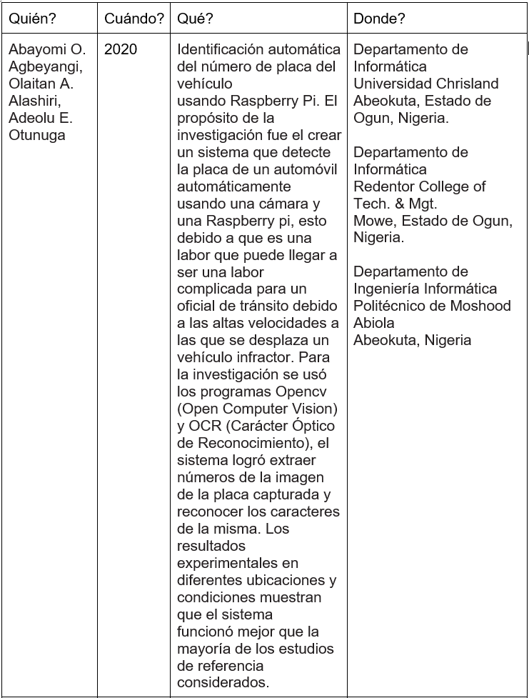
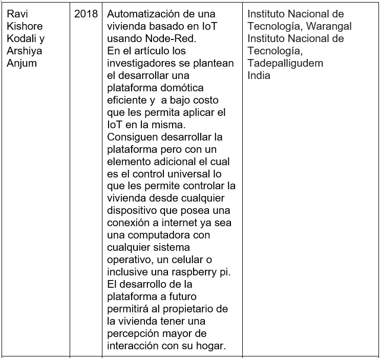
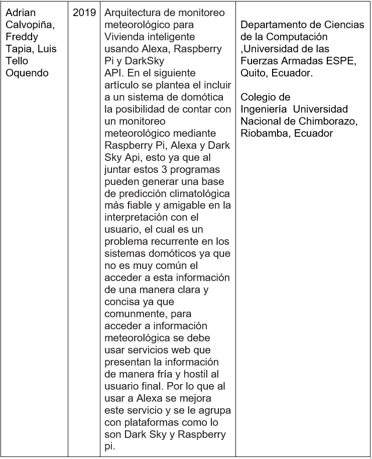
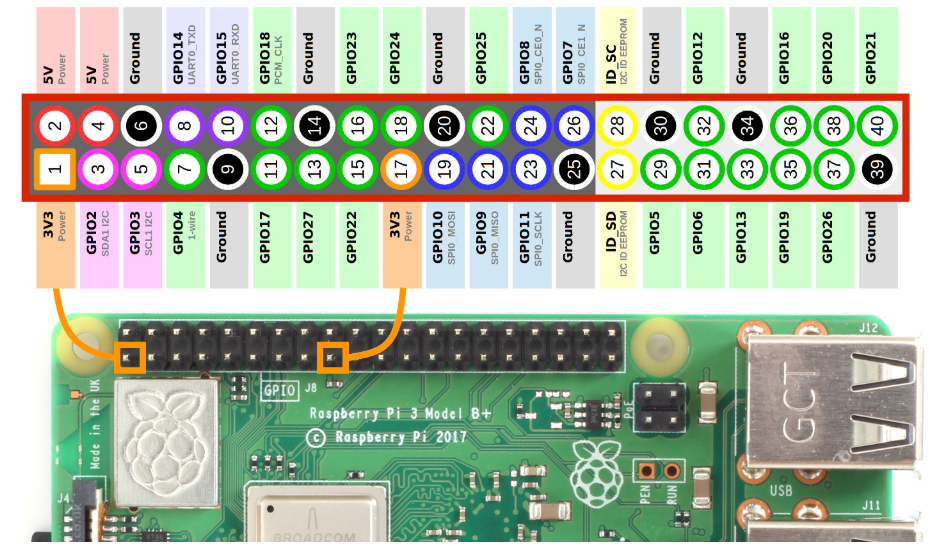

# Producto-de-Unidad-3-Chanchay-Zurita-Lema
## 1. Planteamiento del problema
Mediante la Proogramacion orientada a objetos (POO) resolver 2 problemas propuestos para raspberry pi
## 2. Objetivos
 - **General:**
  - Desarrollar un programa que permita el control de sistemas de automatización mediante el uso de raspberry pi.
 - **Especificos:**
  - Aplicar conceptos de programación orientada a objetos para la elaboración del código fuente.
  - Utilizar la lógica booleana para el diseño del programa de control.
  - Demostrar la utilidad real de los sistemas microcontrolados como lo es raspberry.
## 3. Estado del arte




En relación al producto de unidad los anteriores artículos se ven relacionados más que a la parte académica nos muestran un enfoque real en el que las plataformas como Raspberry nos pueden ayudar en el diario vivir. Esta ayuda se puede dar tanto en nuestra vivienda, como en nuestras calles y como no también en la industria. Esto lo consigue ya que al ser plataformas de bajo costo su uso sería accesible para la mayoría de sus usuarios. En la domótica nos permite aplicar en el internet de las cosas como en la interacción humano máquina, al igual que en el control de tráfico. Pero en la industria tiene su peculiaridad ya que usar estos sistemas nos permitirá generar un valor agregado a nuestros procesos, este valor agregado genera una mayor ventaja frente a los competidores y minimiza costos, con lo cual el uso de Raspberry pi en la actualidad nos permite desarrollarnos hacia generar un estilo de vida más automatizado.

## 4. Marco Teórico

Para el presente proyecto lo que necesitamos saber como pilar fundamental es la GPIO de la Raspberry Pi, debido a que será de gran utilidad al momento de escribir nuestro código y al ayudarnos de nuestra Raspberry Pi.

**¿Que es GPIO?**

General Purpose Input Output (GPIO) es un sistema de entrada y salida de propósito general, es decir, consta de una serie de pines o conexiones que se pueden usar como entradas o salidas para múltiples usos. Estos pines están incluidos en todos los modelos de Raspberry Pi con leves  diferencias.



- Amarillo (2): Alimentación a 3.3V.
- Rojo (2): Alimentación a 5V.
- Naranja (26): Entradas / salidas de proposito general. Pueden configurarse como entradas o salidas. Ten presente que el nivel --alto es de 3.3V y no son tolerantes a tensiones de 5V.
- Gris (2): Reservados.
- Negro (8): Conexión a GND o masa.
- Azul (2): Comunicación mediante el protocolo I2C para comunicarse con periféricos que siguen este protocolo.
- Verde (2): Destinados a conexión para UART para puerto serie convencional.
- Morado (5): Comunicación mediante el protocolo SPI para comunicarse con periféricos que siguen este protocolo.

Aparte de los conocimientos básicos de la GPIO se debe tomar en cuenta la programación orientada a objetos en el lenguaje que vayamos a utilizar, en este caso en específico usaremos Python por lo cual podemos repasar los fundamentos.

**POO en python**

En python la POO se expresa de manera simple y fácil de escribir pero debes tener en cuenta que para programar debes entender cómo funciona la teoría de POO y aplicarla al código.

La teoría de la POO nos dice que todos los objetos deben pertenecer a una clase, ya que esta es la base para diferenciarse unos de otros teniendo atributos y comportamientos que los distingan de otros objetos que pertenezcan a otras clases, para crear clases en python lo hacemos de la siguiente manera:

class Auto():

Para definir un atributo simplemente creamos una variable con total normalidad y un valor cualquiera por dar:

class Auto():

    ruedas=4
    
Para definir un método lo hacemos igual como lo hacemos con una función con la palabra por defecto def y el nombre de dicho método pero para diferenciar un método de una función lo hacemos escribiendo dentro de sus paréntesis el parámetro self:
def desplazamiento(self):

    pass
    
La palabra self hace referencia a los objetos que pertenezcan a la clase y la palabra pass que colocamos dentro del método le indica a el intérprete de python que todavía no le hemos definido ningún funcionamiento a ese método.
Cuando tenemos nuestra clase lista ya podemos empezar a crear objetos que pertenezcan a esa clase, para crear objetos lo hacemos de la siguiente manera:

miVehiculo=Auto()

Para mostrar atributos:

miObjeto.atributo

Para mostrar métodos:

miObjeto.metodo()
 
 
Constructor __init__()
El método __init__() es un método especial, el cual se ejecuta al momento de instanciar un objeto. El comportamiento de __init__() es muy similar a los “constructores” en otros lenguajes. Los argumentos que se utilizan en la definición de __init__() corresponden a los parámetros que se deben ingresar al instanciar un objeto.
   def __init__(self, cedula, nombre, apellido, sexo):
        """Constructor de clase Persona"""
        self.cedula = cedula
        self.nombre = nombre
        self.apellido = apellido
        self.sexo = sexo

## 5. Diagramas
**Circuito Lógico Raspberry**

General Purpose Input Output (GPIO) es un sistema de entrada y salida de propósito general, es decir, consta de una serie de pines o conexiones que se pueden usar como entradas o salidas para múltiples usos. Estos pines están incluidos en todos los modelos de Raspberry Pi con leves  diferencias.

En el siguiente esquema tenemos un raspberry pi y como lo conectaremos con respecto a los componentes electrónicos, enviando señales con interruptores y mostrando la información de salida con un bit representado con un diodo led.
Se usará un solo circuito ya que mediante programación el usuario seleccionara como desea que funcione el sistema ya sea como alarma de incendios o como un sistema de riego.


Para la programación y funcionamiento lo haremos usando la lógica booleana utilizando mapas de verdad que para el caso del sistema de riego el diagrama real es el siguiente:


La tabla de verdad para este circuito es el siguiente:
A: Sensor de Humedad
B: Sensor Deposito
C: Circuito Calendario
D: Célula Fotoeléctrica
Y: Salida


Para la alarma las condiciones y tabla de verdad son las siguientes:

Para ello se tiene un sensor de gases (G), un sensor de humos (H), y dos señales procedentes de un termómetro que indican si la temperatura es mayor de 45ºC (T45) y si la temperatura es mayor de 60ºC (T60).

T60:A'1' si la temperatura es superior a 60ºC
T45:B '1' si la temperatura es superior a 45ºC
Sensor de humos :C '1' si se detecta HUMO.
Sensor de Gases : D ''1' si se detecta GAS resultante de la combustión.
Salida: Y La señal de salida A (alarma) se activará a nivel alto.


## 6. Lista de Componentes
**Circuito Lógico Raspberry:**
 - Raspberry Pi
 - 5 resistencias de 4.7k
 - 1 resistencia de 220
 - 1 diodo led
 - 1 dip switch de 5 interruptores
 - Cables
 - Protoboard

## 7. Mapa de Variables
Programa General


Para cada función describiremos de forma general sus variables


## 8. Explicacion de codigo fuente
```
import time #Importacion de libreria time
import RPi.GPIO as GPIO#Importacion de libreria GPIO

# Clase Bomba para el sistema de riego
class Bomba():
	estado=0#atributo

	def __init__(self, estado):#CONSTRUCTOR
    	self.estado = estado

	def apagado(self):#FUNCION PARA APAGAR LA BOMBA
    	GPIO.output(8,GPIO.LOW)

	def encendido(self):#FUNCION PARA ENCENDER LA bOMBA
    	GPIO.output(8,GPIO.HIGH)

	def analizar(self):# FUNCION PARA ANALIZAR EL ESTADO DE NUESTRAS ENTRADAS
    	#AL USAR LOGICA BOOLEANA DEBEMOS CREAR UNA FUNCION QUE LEA NUESTRAS ENTRADAS Y LES ASUMA VALORES REALES
    	#EN ESTE CASO LE DAREMOS VALORES DE ENTEROS A CADA ENTRADA RELACIONANDOLO CON CADA VALOR DE BIT EN UN SISTEMA POSICIONAL
    	#PARA EL MENOS SIGNIFICATIVO SERA 1 Y PARA EL MAS SIGNIFICATIVO 8 SEGUN EL VALOR DE BIT 2^N
    	#SI SE DETECTA UNA ENTRADA ALTA SE IRAN SUMANDO VALORES A LA VARIABLE SELECCIONADOR QUE SERA ENVIADA A OTRA FUNCION
    	seleccionador=0
    	if GPIO.input(7) == GPIO.HIGH:
        	seleccionador= seleccionador+1
    	if GPIO.input(11) == GPIO.HIGH:
        	seleccionador= seleccionador+2
    	if GPIO.input(13) == GPIO.HIGH:
        	seleccionador= seleccionador+4
    	if GPIO.input(15) == GPIO.HIGH:
        	seleccionador= seleccionador+8
    	return seleccionador #retorno

	def casos(self,caso):#SELECCIONADOR DE CASOS
	#LA FUNCION RECIBIRA UN PARAMETRO DEL CASO BOOLEANO ANTERIORMENTE ANALIZADO SEGUN EL ESTADO DE LOS PINES
	#MEDIANTE LA FUNCION MENSAJE IMPRIMIRA EL ESTADO EN EL QUE SE ENCUENTRA CADA SENSOR
	#SEGUN EL CASO ENCENDERA O APAGARA NUESTRA SALIDA
	#SE TENDRA UNICAMENTE 16 CASOS DEL 0 AL 15 AL CONTAR UNICAMENTE CON 4 VARIABLES

    	if caso==0:
        	self.mensaje("Tierra Humeda")
        	self.mensaje("Deposito de agua lleno")
        	self.mensaje("Calendario sin restricciones")
        	self.mensaje("Es de noche")
        	self.mensaje("Bomba de riego: Desactivada")
        	self.apagado()

    	elif caso==1:
        	self.mensaje("Tierra Humeda")
        	self.mensaje("Deposito de agua lleno")
        	self.mensaje("Calendario sin restricciones")
        	self.mensaje("Es de dia")
        	self.mensaje("Bomba de riego: Desactivada")
        	self.apagado()


    	elif caso==2:
        	self.mensaje("Tierra Humeda")
        	self.mensaje("Deposito de agua lleno")
        	self.mensaje("Calendario con restricciones")
        	self.mensaje("Es de noche")
        	self.mensaje("Bomba de riego: Desactivada")
        	self.apagado()

    	elif caso==3:
        	self.mensaje("Tierra Humeda")
        	self.mensaje("Deposito de agua lleno")
        	self.mensaje("Calendario con restricciones")
        	self.mensaje("Es de dia")
        	self.mensaje("Bomba de riego: Desactivada")
        	self.apagado()

    	elif caso==4:
        	self.mensaje("Tierra Humeda")
        	self.mensaje("Deposito de agua vacio")
        	self.mensaje("Calendario sin restricciones")
        	self.mensaje("Es de noche")
        	self.mensaje("Bomba de riego: Desactivada")
        	self.apagado()

    	elif caso==5:
        	self.mensaje("Tierra Humeda")
        	self.mensaje("Deposito de agua vacio")
        	self.mensaje("Calendario sin restricciones")
        	self.mensaje("Es de dia")
        	self.mensaje("Bomba de riego: Desactivada")
        	self.apagado()


    	elif caso==6:
        	self.mensaje("Tierra Humeda")
        	self.mensaje("Deposito de agua vacio")
        	self.mensaje("Calendario con restricciones")
        	self.mensaje("Es de noche")
        	self.mensaje("Bomba de riego: Desactivada")
        	self.apagado()

    	elif caso==7:
        	self.mensaje("Tierra Humeda")
        	self.mensaje("Deposito de agua vacio")
        	self.mensaje("Calendario con restricciones")
        	self.mensaje("Es de dia")
        	self.mensaje("Bomba de riego: Desactivada")
        	self.apagado()


    	elif caso==8:
        	self.mensaje("Tierra Seca")
        	self.mensaje("Deposito de agua lleno")
        	self.mensaje("Calendario sin restricciones")
        	self.mensaje("Es de noche")
        	self.mensaje("Bomba de riego: Activada")
        	self.encendido()
    	elif caso==9:
        	self.mensaje("Tierra Seca")
        	self.mensaje("Deposito de agua lleno")
        	self.mensaje("Calendario sin restricciones")
        	self.mensaje("Es de dia")
        	self.mensaje("Bomba de riego: Activada")
        	self.encendido()
    	elif caso==10:
        	self.mensaje("Tierra Seca")
        	self.mensaje("Deposito de agua lleno")
        	self.mensaje("Calendario con restricciones")
        	self.mensaje("Es de noche")
        	self.mensaje("Bomba de riego: Activada")
        	self.encendido()


    	elif caso==11:
        	self.mensaje("Tierra Seca")
        	self.mensaje("Deposito de agua lleno")
        	self.mensaje("Calendario con restricciones")
        	self.mensaje("Es de dia")
        	self.mensaje("Bomba de riego: Desactivada")
        	self.apagado()
    	elif caso==12:
        	self.mensaje("Tierra Seca")
        	self.mensaje("Deposito de agua vacio")
        	self.mensaje("Calendario sin restricciones")
        	self.mensaje("Es de noche")
        	self.mensaje("Bomba de riego: Desactivada")
        	self.apagado()

    	elif caso==13:
        	self.mensaje("Tierra Seca")
        	self.mensaje("Deposito de agua vacio")
        	self.mensaje("Calendario sin restricciones")
        	self.mensaje("Es de dia")
        	self.mensaje("Bomba de riego: Desactivada")
        	self.apagado()

    	elif caso==14:
        	self.mensaje("Tierra Seca")
        	self.mensaje("Deposito de agua vacio")
        	self.mensaje("Calendario con restricciones")
        	self.mensaje("Es de noche")
        	self.mensaje("Bomba de riego: Desactivada")
        	self.apagado()

    	elif caso==15:
        	self.mensaje("Tierra Seca")
        	self.mensaje("Deposito de agua vacio")
        	self.mensaje("Calendario con restricciones")
        	self.mensaje("Es de dia")
        	self.mensaje("Bomba de riego: Desactivada")
        	self.apagado()


	def mensaje(self,mens):#FUNCION MENSAJE
	#NOS PERMITE IMPRIMIR UN MENSAJE CUALQUIERA
    	print(mens)


class Alarma():# Clase Bomba para el sistema de riego
	estado=0#ATRIBUTO ESTADO

	def __init__(self, estado):#CONSTRUCTOR
    	self.estado = estado

	def apagado(self):#FUNCION PARA APAGAR LA BOMBA
    	GPIO.output(8,GPIO.LOW)

	def encendido(self):#FUNCION PARA ENCENDER LA bOMBA
    	GPIO.output(8,GPIO.HIGH)

	def analizar(self):# FUNCION PARA ANALIZAR EL ESTADO DE NUESTRAS ENTRADAS
    	#AL USAR LOGICA BOOLEANA DEBEMOS CREAR UNA FUNCION QUE LEA NUESTRAS ENTRADAS Y LES ASUMA VALORES REALES
    	#EN ESTE CASO LE DAREMOS VALORES DE ENTEROS A CADA ENTRADA RELACIONANDOLO CON CADA VALOR DE BIT EN UN SISTEMA POSICIONAL
    	#PARA EL MENOS SIGNIFICATIVO SERA 1 Y PARA EL MAS SIGNIFICATIVO 8 SEGUN EL VALOR DE BIT 2^N
    	#SI SE DETECTA UNA ENTRADA ALTA SE IRAN SUMANDO VALORES A LA VARIABLE SELECCIONADOR QUE SERA ENVIADA A OTRA FUNCION
    	seleccionador=0
    	if GPIO.input(7) == GPIO.HIGH:
        	seleccionador= seleccionador+1
    	if GPIO.input(11) == GPIO.HIGH:
        	seleccionador= seleccionador+2
    	if GPIO.input(13) == GPIO.HIGH:
        	seleccionador= seleccionador+4
    	if GPIO.input(15) == GPIO.HIGH:
        	seleccionador= seleccionador+8
    	return seleccionador

	def casos(self,caso):#SELECCIONADOR DE CASOS
	#LA FUNCION RECIBIRA UN PARAMETRO DEL CASO BOOLEANO ANTERIORMENTE ANALIZADO SEGUN EL ESTADO DE LOS PINES
	#MEDIANTE LA FUNCION MENSAJE IMPRIMIRA EL ESTADO EN EL QUE SE ENCUENTRA CADA SENSOR
	#SEGUN EL CASO ENCENDERA O APAGARA NUESTRA SALIDA
	#SE TENDRA UNICAMENTE 16 CASOS DEL 0 AL 15 AL CONTAR UNICAMENTE CON 4 VARIABLES
    	if caso==0:
        	self.mensaje("Sin gases")
        	self.mensaje("Sin humo")
        	self.mensaje("Temperatura inferior a 45 grados")
        	self.mensaje("Alarma: Desactivada")
        	self.apagado()

    	elif caso==1:
        	self.mensaje("Se detectaron gases")
        	self.mensaje("Sin humo")
        	self.mensaje("Temperatura inferior a 45 grados")
        	self.mensaje("Alarma: Desactivada")
        	self.apagado()


    	elif caso==2:
        	self.mensaje("Sin gases")
        	self.mensaje("Se detecto humo")
        	self.mensaje("Temperatura inferior a 45 grados")
        	self.mensaje("Alarma: Desactivada")
        	self.apagado()

    	elif caso==3:
        	self.mensaje("Se detectaron gases")
        	self.mensaje("Se detecto humo")
        	self.mensaje("Temperatura inferior a 45 grados")
        	self.mensaje("Alarma: Activada")
        	self.encendido()

    	elif caso==4:
        	self.mensaje("Sin gases")
        	self.mensaje("Sin humo")
        	self.mensaje("Temperatura superior a 45 grados")
        	self.mensaje("Temperatura inferior a 60 grados")
        	self.mensaje("Alarma: Desactivada")
        	self.apagado()

    	elif caso==5:
        	self.mensaje("Se detectaron gases")
        	self.mensaje("Sin humo")
        	self.mensaje("Temperatura superior a 45 grados")
        	self.mensaje("Temperatura inferior a 60 grados")
        	self.mensaje("Alarma: Activada")
        	self.encendido()


    	elif caso==6:
        	self.mensaje("Sin gases")
        	self.mensaje("Se detecto humo")
        	self.mensaje("Temperatura superior a 45 grados")
        	self.mensaje("Temperatura inferior a 60 grados")
        	self.mensaje("Alarma: Activada")
        	self.encendido()

    	elif caso==7:
        	self.mensaje("Se detectaron gases")
        	self.mensaje("Se detecto humo")
        	self.mensaje("Temperatura superior a 45 grados")
        	self.mensaje("Temperatura inferior a 60 grados")
        	self.mensaje("Alarma: Activada")
        	self.encendido()


    	elif caso==8:
        	self.mensaje("Sin gases")
        	self.mensaje("Sin humo")
        	self.mensaje("Temperatura superior a 60 grados")
        	self.mensaje("Alarma: Activada")
        	self.encendido()
    	elif caso==9:
        	self.mensaje("Se detectaron gases")
        	self.mensaje("Sin humo")
        	self.mensaje("Temperatura superior a 60 grados")
        	self.mensaje("Alarma: Activada")
        	self.encendido()
    	elif caso==10:
        	self.mensaje("Sin gases")
        	self.mensaje("Se detecto humo")
        	self.mensaje("Temperatura superior a 60 grados")
        	self.mensaje("Alarma: Activada")
        	self.encendido()


    	elif caso==11:
        	self.mensaje("Se detectaron gases")
        	self.mensaje("Se detecto humo")
        	self.mensaje("Temperatura superior a 60 grados")
        	self.mensaje("Alarma: Activada")
        	self.encendido()
    	elif caso==12:
        	self.mensaje("Sin gases")
        	self.mensaje("Sin humo")
        	self.mensaje("Temperatura superior a 60 grados")
        	self.mensaje("Alarma: Activada")
        	self.encendido()

    	elif caso==13:
        	self.mensaje("Se detectaron gases")
        	self.mensaje("Sin humo")
        	self.mensaje("Temperatura superior a 60 grados")
        	self.mensaje("Alarma: Activada")
        	self.encendido()

    	elif caso==14:
        	self.mensaje("Sin gases")
        	self.mensaje("Se detecto humo")
        	self.mensaje("Temperatura superior a 60 grados")
        	self.mensaje("Alarma: Activada")
        	self.encendido()

    	elif caso==15:
        	self.mensaje("Se detectaron gases")
        	self.mensaje("Se detecto humo")
        	self.mensaje("Temperatura superior a 60 grados")
        	self.mensaje("Alarma: Activada")
        	self.encendido()


	def mensaje(self,mens):#FUNCION MENSAJE
	#NOS PERMITE IMPRIMIR UN MENSAJE CUALQUIERA
    	print(mens)


class Seleccion():#CLASE SELECCION PARA ELEGIR EL MODO DE FUNCIONAMIENTO
	seleccion=0#ATRIBUTO

	def __init__(self, seleccion):#CONSTRUCTOR
    	self.seleccion = seleccion

	def iniciarGPIO(self):#FUNCION PARA INICIAR LA GPIO
    	GPIO.setmode(GPIO.BOARD)#ACTIVAR GPIO
    	#ENTRADAS
    	GPIO.setup(7,GPIO.IN)
    	GPIO.setup(11,GPIO.IN)
    	GPIO.setup(13,GPIO.IN)
    	GPIO.setup(15,GPIO.IN)
    	GPIO.setup(19,GPIO.IN)
    	#SALIDA
    	GPIO.setup(8,GPIO.OUT)

	def tempo(self):#FUNCION PARA MOSTRAR UN MENSAJE INICIAL
	#CADA MENSAJE SE MOSTRARA CON UN TIEMPO DE 1 SEGUNDO
	#ESTE TIEMPO SERA PARA QUE EL USUARIO PUEDA ESCOJER EL MODO DE FUNCIONAMIENTO ADECUADO
    	print("****Bienvenido*****")
    	time.sleep(1)
    	print("****Sistema Automatico de Alarma*****")
    	time.sleep(1)
    	print("Selecione metodo de operacion en el interruptor (GPIO19)")
    	time.sleep(1)
    	print("Bombas de Agua (0) ")
    	print("Alarma contra incendios (1)")
    	time.sleep(1)
    	print("Dispone de 15 segundos ")
    	time.sleep(1)
    	#CONTADOR REGRESIVO PARA SELECCIONAR EL MODO DE OPERACION
    	for i in range(15):
        	print(15-i)
        	time.sleep(1)


	def elegir(self):#FUNCION PARA SELECCIONAR EL MODO DE OPERACION
	#LA VARIABLE SELECT NOS SABER QUE MODO DE OPERACION ESCOJIO EL USUARIO
	#SE LEERA EL PUERTO 13 Y DEPENDIENDO DE SU ESTADO SE ALMACENARA UN VALOR DE 1 O 0 EN SELECT PARA QUE SE EJECUTE UNO DE LOS 2 PROGRAMAS
    	select=0
    	if GPIO.input(19) == GPIO.HIGH:
        	select=0
    	if GPIO.input(19) == GPIO.HIGH:
        	select=1
    	return select

#PROGRAMA PRINCIPAL

seleccion=Seleccion(0)#INICIAMOS LA CLASE SELECCION
alarma=Alarma(0)#INICIAMOS LA CLASE ALARMA
bomba=Bomba(0)#INICIAMOS LA CLASE ALARMA

seleccion.iniciarGPIO()#LLAMAMOS A LA FUNCION INICIAR GPIO
seleccion.tempo()#MOSTRAMOS EL MENSAJE INICIAL
sele=seleccion.elegir()#MANDAMOS AL PROGRAMA A LEER EL PIN DESTINADO AL MODO DE FUNCIONAMIENTO

if sele==0:#CASO PARA LA BOMBA DE AGUA
	bomba.mensaje("MODO BOMBA DE AGUA")#MOSTRAMOS UN MENSAJE INICIAL
	aux=100#VARIABLE AUXILIAR QUE NOS AYUDARA EN UN CASO INICIAL
	while 1:#BUCLE REPETITIVO
    	caso=bomba.analizar()#LLAMAMOS AL ANALISIS DE PUERTOS Y EL VALOR ENTERO DE LOS PUERTOS SE ALMACENA EN LA VARIABLE CASO
    	if caso!=aux:#COMPARAMOS EL CASO CON RESPECTO A LA VARIABLE AUXILIAR QUE PARA LA PRIMERA LECTURA SE VA A CUMPLIR
    	#ESTA FUNCION NOS SERA UTIL MARA NO MANDAR EXCESIVOS DATOS A LA CONSOLA YA QUE UNICAMENTE EN CASO DE CAMBIAR DE ESTADO LAS ENTRADAS
    	#SE CAMBIARA LOS DATOS DE LA CONSOLA Y LA SALIDA
        	bomba.mensaje("----------")
        	bomba.casos(caso)#LLAMAMOS A LA FUNCION QUE EFECTUARA NUESTRO CASO
    	aux=caso#GUARDAMOS A LA VARIABLE AUX EL CASO ACTUAL PARA QUE NUESTRA CONSOLA NO CAMBIE
elif sele==1:#CASO PARA LA ALARMA
	alarma.mensaje("MODO ALARMA DE INCENDIOS")#MOSTRAMOS UN MENSAJE INICIAL
	aux=100#VARIABLE AUXILIAR QUE NOS AYUDARA EN UN CASO INICIAL
	while 1:#BUCLE REPETITIVO
    	caso=alarma.analizar()#LLAMAMOS AL ANALISIS DE PUERTOS Y EL VALOR ENTERO DE LOS PUERTOS SE ALMACENA EN LA VARIABLE CASO
    	if caso!=aux:#COMPARAMOS EL CASO CON RESPECTO A LA VARIABLE AUXILIAR QUE PARA LA PRIMERA LECTURA SE VA A CUMPLIR
    	#ESTA FUNCION NOS SERA UTIL MARA NO MANDAR EXCESIVOS DATOS A LA CONSOLA YA QUE UNICAMENTE EN CASO DE CAMBIAR DE ESTADO LAS ENTRADAS
    	#SE CAMBIARA LOS DATOS DE LA CONSOLA Y LA SALIDA
        	alarma.mensaje("----------")
        	alarma.casos(caso)#LLAMAMOS A LA FUNCION QUE EFECTUARA NUESTRO CASO
    	aux=caso#GUARDAMOS A LA VARIABLE AUX EL CASO ACTUAL PARA QUE NUESTRA CONSOLA NO CAMBIE
```
     
## 9. Descripción de Prerrequisitos y configuración.
Al ser una práctica simulada no se necesita pre requisitos únicamente importar nuestra librería de gpio en el simulador.

## 10. Aportaciones
Como aportación se ha procedido a realizar de manera física un circuito con el  cual podamos demostrar las diferentes funciones que se realizaron en el program.


En esta parte procedemos a correr el programa en la raspberry pi 


Y procedemos controlar mediante el switch las diferente variables si se encuentran en alto o en bajo las cuales corresponden a su respectivo pin del gpio de la raspberry pi y controlan diferentes funciones del programa.

**Controlar Raspberry Pi mediante VNC Viewer**

Primero debemos activar en las configuraciones de la raspberry pi el vnc 


después procedemos a activar el modo automático de login


Debemos tener una conexión a internet y también debemos descargar el vnc viewer para la plataforma la cual estemos usando https://www.realvnc.com/es/connect/download/viewer/


procedemos a ingresar dentro de vnc y conectarnos a la raspberry con la ip que se encuentre en la red


cuando nos estemos conectando tenemos que usar las siguientes credenciales


y ya ingresaron desde la pc a la raspberry


## 11. Recomendaciones
- Para implementar el circuito en un armado real, armar el circuito sin alimentar el raspberry.
- Considerar los pines de gpio que permitan el trabajo exclusivo de entrada o salida, evitando el uso de pines como el i2c o uart.
- Si el funcionamiento de cada programa es parecido implementar las mismas funciones para cada clase.
## 12. Cronograma
## 13. Bibliografía
Agbeyangi, A. O., Alashiri, O. A., & Otunuga, A. E. (2020). Automatic Identification of Vehicle Plate Number using Raspberry Pi. 2020 International Conference in Mathematics, Computer Engineering and Computer Science (ICMCECS). doi:10.1109/icmcecs47690.2020.246983

Calvopinna, A., Tapia, F., & Tello-Oquendo, L. (2019). Weather monitoring architecture for smart home using alexa, raspberry Pi, and DarkSky API. 2019 8th International Conference on Software Process Improvement, CIMPS 2019 - Applications in Software Engineering. https://doi.org/10.1109/CIMPS49236.2019.9082423

Kodali, R. K., & Anjum, A. (2018). IoT Based HOME AUTOMATION Using Node-RED. 2018 Second International Conference on Green Computing and Internet of Things (ICGCIoT). doi:10.1109/icgciot.2018.8753085

## 14. Anexos
Manual de usuario
Debemos crear un proyecto en https://create.withcode.uk/


Entonces debemos copiar y pegar el código anteriormente mostrado.


Para verificar su funcionamiento debemos darle play en la esquina inferior derecha


Se nos mostrarán los pines gpio los cuales son representados los cuadrados como entradas y los círculos como salidas.
El funcionamiento del programa es el siguiente:
Primero se nos mostrará un mensaje de inicio con un conteo regresivo en la consola para seleccionar el modo de funcionamiento en el pin 19.
Donde 1 será para la alarma y 0 para la bomba de agua.


Bomba de agua 
Los pines y sensores están distribuidos de la siguiente forma:
7: Luz
11: Calendario
13: Depósito de agua
15: Humedad
19: Salida de Bomba

Si el circuito detecta un cambio se mostrará la información en la consola y dependiendo del caso la salida cambiará de estado.


Bomba de agua 
Los pines y sensores están distribuidos de la siguiente forma:
7: Gases
11: Humo
13: Temperatura de 45 grados
15: Temperatura de 60 grados
19: Salida de Alarma

Si el circuito detecta un cambio se mostrará la información en la consola y dependiendo del caso la salida cambiará de estado.


El programa se ejecutará infinitamente hasta que se cierre la aplicación.
